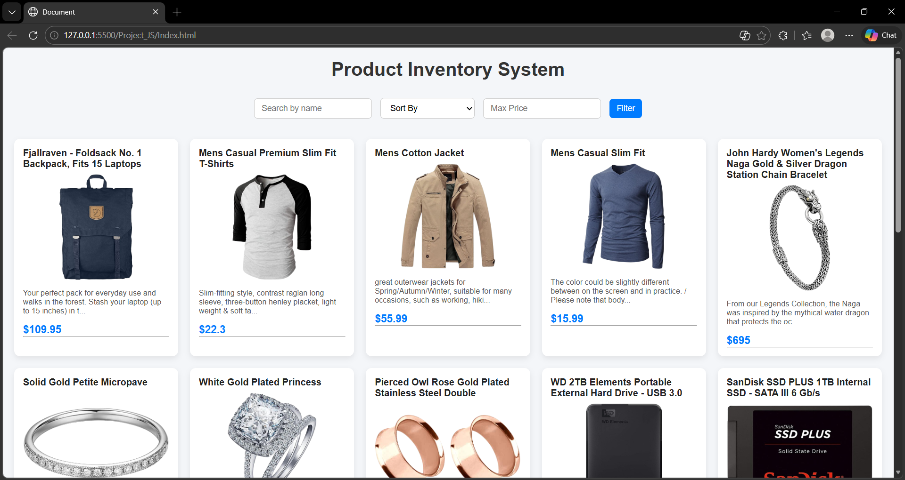
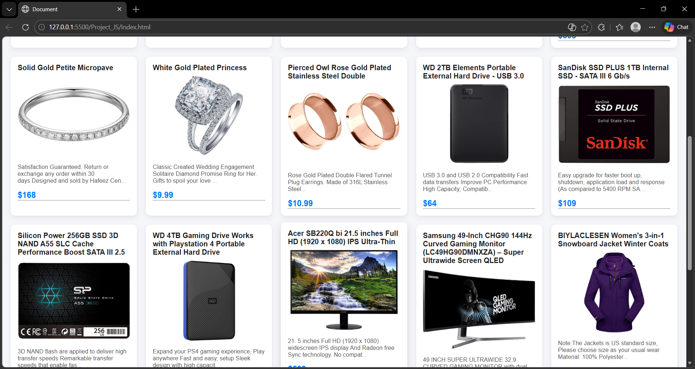
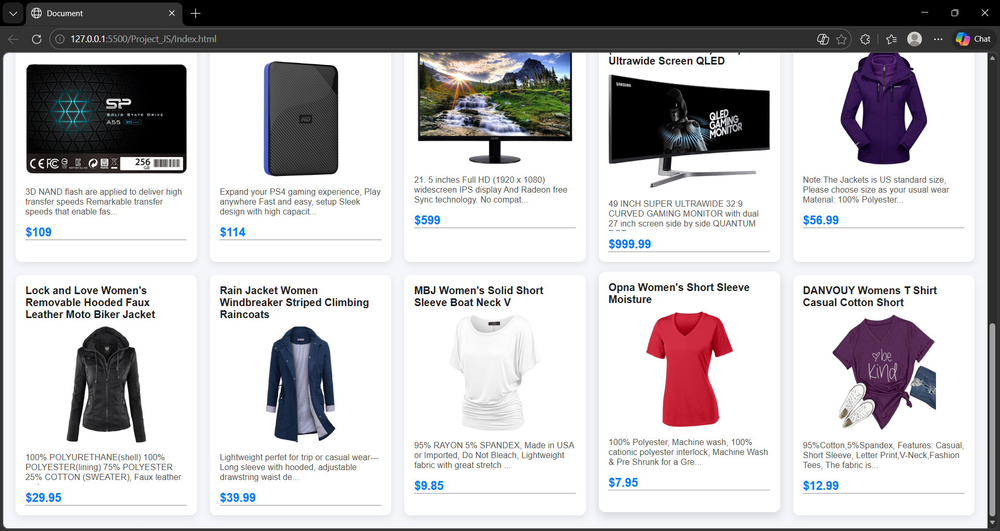

# Product Inventory System

A simple product inventory web application that fetches data from FakeStore API and displays products with search, filtering, and sorting functionality.

## Features:

- Fetch product data from FakeStore API
- Product search
- Price filtering
- Sorting by price and name

## Technologies Used:

- HTML
- CSS
- JavaScript
- FakeStore API

## Author:

Anas Altaf Shaikh

## 📸 Project Preview

